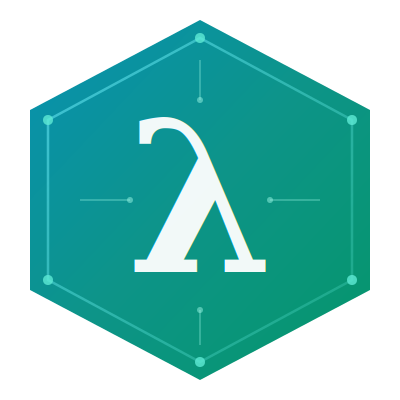

  

<h1 align="center">Fe</h1>

Fe is a statically typed language that compiles to JavaScript. It was built around one principle: the compiler should eliminate whole categories of bugs before a program ever executes.

The static analysis phase resolves every identifier at compile time and infers types from surrounding context. Explicit annotations are only required when a declaration is genuinely ambiguous. Function signatures are verified against every call site, return paths are traced across every branch, and control flow keywords are validated against the enclosing structure they belong to. When the analyzer detects a violation it produces a precise diagnostic with enough surrounding context for the programmer to understand exactly what went wrong and why.

The syntax draws from conventions most developers already know, so there is no meaningful barrier to reading or writing Fe code. The compiler is organized as four sequential stages: parse, analyze, optimize, and generate. Each stage carries a single well-defined responsibility and produces structured output that flows directly into the next.

<strong>Kushal Jayaswal</strong>
